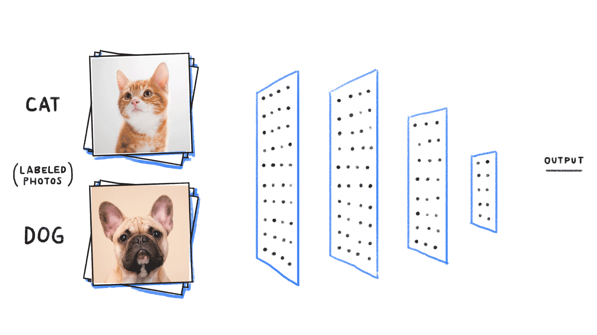

# Cats and Dogs Classifier

This project was part of the [Free Code Camp Machine Learning course](https://www.freecodecamp.org/learn/machine-learning-with-python/#how-neural-networks-work), which aimed to introduce students to Convolutional Neural Networks (CNNs). The challenge was to build a CNN capable of distinguishing between cat and dog images.

The image preprocessing was performed using TensorFlow methods, and the Neural Network architecture was built using Keras. The CNN model was trained using a dataset of cat and dog images given as part of the course’s resources.

In addition, the accuracy and loss evolution of the model during the training are displayed using Matplotlib. This allows to visualize how the accuracy and loss of the model changed over time as it processed more and more data.

At the end, the CNN model was able to achieve an accuracy of 70% in correctly classifying cat and dog images.

  

